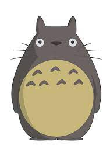

# [rsschool-cv](https://github.com/catcustest/rsschool-cv)

-----------

-----------
## Darya Krakhmaleva

-----------
### AQA

-----------
### Contact information:

E-mail: catcusgetpwd@gmail.com
Telegram: @cattcus

-----------
### Summary:

As testing engineer, I am an expert in functional testing of web and desktop applications, requirements analysis, 
test cases creation and maintenance, defects tracking, reporting test results. 
As automation QA, I have experience in creating and maintaining framework for API tests using python, pytest, sqlalchemy, wiremock.

-----------
### Code example:

    def generate_random_number(num=4):
    random_number = []
    for _ in range(0, num):
        number = random.randint(1, 4)
        random_number.append(number)
    return "".join(map(str, random_number))

-----------
### Languages:

   - English: B2
   - Belarusian: Native
   - Russian: Native
